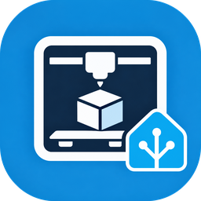

# Generic 3D Printer Controller

One Home Assistant integration for a **mixed 3D printer fleet**. Each printer is a
config entry, each protocol is an adapter, and everything a user sees reads one
shared model, so the dashboard, the entities and the automations never learn which
protocol a printer speaks.

Covers the **Elegoo Centauri Carbon** (SDCP) and **Centauri Carbon 2** (MQTT),
Elegoo's SDCP V3 resin printers such as the **Saturn 4 Ultra 16K**, the
**Anycubic Kobra 3, 4, S1 and X** (LAN mode), **Klipper via Moonraker**,
**OctoPrint**, **Duet / RepRapFirmware**, and any printer
whose only interface is its own embedded web page. Adding a protocol is one module
plus one registry entry.

Ships its own Lovelace card, `custom:generic-3dprinter-card`: one card that drives
the whole printer, with its camera, its job, its heaters and fans, a joystick for
the head, its stored files, and the smart plug it is powered from.

## Why this exists

A home lab accumulates printers that share nothing. Each vendor invents its own
LAN protocol, its own idea of a print job, its own way to say "72 percent done".
The usual outcome is one integration per protocol, each with its own entities and
its own card, and no single place to see the fleet.

This integration inverts that. Every protocol difference lives behind one adapter
interface, and the capability set is data, so a printer that cannot pause has no
pause button rather than a button that fails when pressed.

## What you get per printer

**Sensors.** Printer state, progress, current and total layer, time remaining,
time elapsed, file name, nozzle / bed / chamber temperature and target, fan duty,
speed and flow factor, and diagnostics for protocol, model, firmware, serial and
address. A resin printer has no nozzle or bed; it gets its print phase, UV LED
temperature, vat temperature and target, and release film lifts instead.

**Controls.** Pause, resume, stop and home buttons; target temperatures, speed
factor, flow factor and fan duty as numbers; the chamber light as a switch. Each
one exists only when the printer says it supports it. The card adds a joystick,
temperature presets, and file upload, print and delete on top.

**Filament.** A printer with a multi-material unit, such as Elegoo's CANVAS, gets
a sensor per slot with the filament's name, material, brand, colour and nozzle
range, a sensor for the filament in use, and an auto-refill switch where the printer
can be told. The card shows the unit in a popup of its own.

**Camera.** A live MJPEG stream, not a slideshow. The card and Home Assistant's own
camera proxy both read from one shared upstream connection per printer, so a
dashboard tile, the card and a notification do not each open their own. That
sharing is a requirement on hardware whose camera server keeps only a few
connection slots and leaks them.

**The printer's own page.** For a printer with no control API, its embedded page is
reverse-proxied through Home Assistant and its control WebSocket is bridged, so a
dashboard served over HTTPS can embed a printer that only speaks HTTP on the LAN.

## Install

### HACS

1. In Home Assistant, open **HACS**, then the three-dot menu, then **Custom
   repositories**.
2. Add `https://github.com/dnviti/ha-generic-3dprinter-controller` with category
   **Integration**.
3. Search HACS for **Generic 3D Printer Controller** and install it.
4. Restart Home Assistant.

### Manually

Copy `custom_components/generic_3dprinter` into your Home Assistant
`config/custom_components/` directory and restart.

## Configure a printer

**Settings → Devices & Services → Add Integration → Generic 3D Printer
Controller.**

You can let it look for a printer on the network, or pick the protocol yourself.
Discovery is a convenience, never a guess: a probe that finds something fills in
the form and you still confirm it. Nothing in the config flow sends a command to a
printer.

The Centauri Carbon appears once in the protocol menu, as **Elegoo Centauri
Carbon**, and a second step asks which model it is: the two generations speak
different protocols.

| Protocol | Default port | Credential |
| --- | --- | --- |
| Elegoo Centauri Carbon (SDCP) | 3030, camera 3031 | none on the LAN |
| Elegoo Centauri Carbon 2 (MQTT) | 1883, camera 8080 | access code, if one is set |
| Elegoo resin (Saturn, Mars), SDCP | 3030, camera RTSP 554 | none; the mainboard id is read from the printer |
| Anycubic Kobra (LAN mode) | 18910, broker 9883, camera 18088 | none: the printer hands them out |
| Klipper via Moonraker | 7125 | API key, if Moonraker requires one |
| OctoPrint | 5000 or 80 | API key |
| Duet (RepRapFirmware) | 80 | password, if the board has one |
| Web page only | 80 | username and password, if the page asks |

The camera port for SDCP defaults to 3031 and only needs changing if you moved it.

### Centauri Carbon 2: turn on LAN-only mode first

A Centauri Carbon 2 answers local clients **only in LAN-only mode**. In cloud mode
its broker still accepts a connection, and then nothing ever answers. So, on the
printer's screen:

1. **Settings → Network → LAN Only Mode**, and turn it on.
2. If the printer shows an **access code** there, enter it in the integration.
   With no code set, leave the field empty.

The serial number is read from the printer when you add it, so its field can stay
empty. The config flow checks the mode and refuses a printer in cloud mode with
that instruction, rather than creating an entry that never connects. LAN-only mode
turns off Elegoo's cloud and the remote access of its phone app.

The printer shares a handful of client slots between the slicer, the phone app and
integrations like this one. If it reports that none is free, close one of them.

### Anycubic Kobra: turn on LAN Mode first

A Kobra answers local clients only in **LAN Mode**: on the printer's screen,
**Settings → Network → LAN Mode**. Then add it with its address alone. The
integration reads its model and serial, and the printer hands out its own broker
credentials each time the integration connects, so there is nothing to type and
nothing secret is stored.

What the card offers follows the model. A Kobra X can be homed and jogged, and its
temperatures and fan can be set while idle. The Kobra 3, 4 and S1 apply
temperatures, fans and speed only during a print, and the card says so rather than
sending them. The Kobra X's built-in four-colour changer, and any ACE, appear as a
multi-material unit with auto-feed. The camera is a video stream Home Assistant
plays. Files can be listed and printed, but not uploaded yet.

**The Kobra X has been checked on a real printer**, firmware 2.0.1.9: status, the
colour changer, files, the camera, the light, a nozzle target, the part fan, homing
X and Y and a jog of X. Starting, pausing and stopping a print, the speed,
auto-feed, homing Z or all axes and jogging Y or Z are not measured yet. The other Kobras are built from the published work of other projects, listed
in `docs/protocol-anycubic-kobra.md`, and the card marks them as unverified.
`tools/acceptance_kobra.py` checks a printer.

### Elegoo resin printers

Elegoo's resin printers that speak SDCP V3, such as the Saturn 4 Ultra 16K, have
their own entry in the protocol menu, **Elegoo resin (Saturn, Mars) – SDCP**. Add
one by its address: the integration asks it for its mainboard id, which every
request is addressed to, and fills the serial number with it. If the printer does
not answer that question, type the mainboard id in the serial number field.

You get the printer's state and the phase of each layer, such as exposing or
lifting, the layer, progress and time left, the UV LED's temperature, the vat's
temperature and the target the printer keeps, the release film's lifts against the
count it is rated for, any failing device check or print error, and the files in its
internal storage. Pause, resume and stop, file delete, and upload of `.ctb` and
`.goo` files, the types the printer names, come on top. There are no temperatures,
fans, light or motion to set: none of them is a command a resin printer takes.

Starting a print and the camera are each an opt-in, off by default (see below).

**The Saturn 4 Ultra 16K has been checked on a real printer**, firmware V1.5.6: its
status and its phases through a real job, starting, pausing, resuming and stopping
a print, files and history, upload and delete, and the camera. The Saturn 4 Ultra and the Mars 5 Ultra are marked unverified.
`docs/protocol-elegoo-sdcp-resin.md` has every measurement and source, and
`tools/acceptance_sdcp_resin.py` checks a printer read-only.

The Saturn 3 Ultra and the Mars 4 Ultra speak an older SDCP over MQTT, are **not
supported**, and are refused when you add them.

A resin printer and a Centauri Carbon answer on the same port. An Elegoo Centauri
Carbon entry that finds a resin printer at its address when it is set up stops with
an error saying so, before it sends any Centauri command. An entry already running
when a resin printer takes the address goes offline with that error and keeps
retrying, and each retry sends only the read-only attribute request (command 1)
before it stops again. Either way, remove it and add the printer as an Elegoo resin
printer. A resin entry that finds an FDM printer, or another resin printer than its
own, stops the same way.

### The dangerous settings

On Elegoo SDCP, **starting a print over the network** is off by default and is
asked as an explicit opt-in when you add the printer. Read the reason before you
turn it on.

Elegoo's SDCP start-print command carries a six-field payload that this
integration builds itself. On Centauri Carbon firmware, an unrecognised command
code, or a recognised code sent with an unexpected payload shape, has been
reported to crash the printer's `app` daemon. On that hardware `app` is the whole
host firmware including the motion stack, so a crash destroys a running print and
needs a power cycle at the wall.

Everything else the integration sends a Centauri Carbon is a command the printer's
own page or Elegoo's tools send, and the adapter never probes an unknown code. Only
the reads (commands 0, 1, 258, 320 and 324) and the camera were checked on a
printer. Pause, stop, resume and delete (129, 130, 131, 259), the upload, and the
temperature, fan, speed and light settings (the four variants of 403) come from the
pycentauri field notes and Elegoo's SDK and were not sent to hardware by this
project; that command 386 brings the camera back after a power cycle was reported by
a user. The Centauri Carbon this was developed on has since been sold, so none of
this can be checked on it again. You can enable or disable the opt-in later in the
integration's **Configure** dialog.

The Centauri Carbon 2 has the same opt-in, for a different reason: starting a print
heats and moves a machine nobody is watching. Its firmware also remembers the last
auto-levelling choice, so the integration always asks for levelling, and lets the
printer choose the Canvas tray, because a wrong tray mapping is accepted and then
printed from the first tray. Moving the head and homing are refused unless the
printer reports itself idle.

An Anycubic Kobra has the same opt-in: its start request is documented only for the
Kobra 3 through custom firmware.

An Elegoo resin printer has two opt-ins, both off by default:

* **Allow starting a print over the network.** A resin print lowers the platform
  into the vat and exposes the resin with nobody at the printer, and nothing on the
  network can tell whether the vat has resin in it and the vat and platform are
  clean. The integration sends only the two fields the SDCP V3 specification gives,
  and only when the printer says it is idle. The card asks you to confirm the vat
  and the platform first.
* **Allow the camera.** The camera is an RTSP stream with room for two viewers, and
  a viewer that is not closed cleanly keeps its place until the printer is switched
  off and on. The integration opens it only while both places are free, at most once
  every 10 seconds and not in a print's first three layers, and closes it
  gracefully, but freeing a stuck place may still need a power cycle. Close
  Elegoo's slicer and app while the camera is in use. The video comes over UDP, so
  Home Assistant has to be on the printer's network: Home Assistant OS, or a
  container on the host network, not one behind NAT.

## The card

The integration adds the card to your dashboards' resources itself, as soon as it
loads and whether or not a printer is on, and keeps that entry at the current
version. It appears under Settings, Dashboards, Resources as
`/generic_3dprinter/generic-3dprinter-card.js`; there is nothing to add by hand, and
an entry added by hand earlier is taken over rather than duplicated. If your
Lovelace resources are kept in YAML, the card is loaded as an extra module instead.
Put it on a dashboard:

```yaml
type: custom:generic-3dprinter-card
```

```yaml
type: custom:generic-3dprinter-card
entry_id: 01J...            # optional, the first printer otherwise
power_entity: switch.printer_plug
temperature_presets:
  - { name: PLA, hotend: 210, bed: 60 }
  - { name: PETG, hotend: 240, bed: 80 }
jog_steps: [0.1, 1, 10, 50]
```

```yaml
type: custom:generic-3dprinter-card
title: Printers
fleet: true
```

It has a visual editor, so all of this can also be set from the dashboard.

| Option | Meaning |
| --- | --- |
| `entry_id` | Show one specific printer |
| `power_entity` | The switch, light or input boolean the printer is powered from, such as a Shelly plug |
| `show_camera` | `false` hides the camera |
| `temperature_presets` | Buttons that set the nozzle and the bed together; PLA, PETG and ABS by default |
| `jog_steps` | The distances the joystick offers, in millimetres |
| `fleet` | Show every configured printer, compactly |
| `title` | Heading above the card |

With neither `entry_id` nor `fleet`, the card shows the first printer.

One printer gets three tabs:

* **Status**: progress, layers, time remaining and the time it will be done,
  temperatures, fans, and pause, resume and stop. Stop asks first.
* **Controls**: nozzle, bed and chamber targets with nudge buttons, presets and a
  cool-down; fan and speed sliders; a joystick for X and Y with a Z column, homing,
  a step selector and the live position. The arrow keys and Page Up / Page Down
  move the head while the joystick has focus. Motion is disabled while a job runs.
* **Files**: the printer's files, with print and delete where the printer allows
  them, and an upload that can start the print once the file is on the printer.

**Filament.** A printer with a multi-material unit gets a filament button in the
header and a strip on the Status tab: one dot per slot in its filament's colour, and
the filament in use. Either opens a popup that draws the unit the way it stands,
four spools numbered as on the unit, with the slot in use marked. Selecting a slot
shows its material, brand, colour and nozzle range, and the buttons the printer
allows:

* **Load** feeds a loaded slot into the nozzle, and **Unload** pulls the one in use
  back. Both ask first, and both are off while the printer is busy.
* **Edit** records which filament is in a slot: brand, filament from the printer's
  own list, colour and nozzle range.
* **Auto-refill** switches to a matching slot when one runs out.

While the unit works, the popup and the strip say what it is doing, such as
"Loading: heating the nozzle". What each printer allows:

| Printer | Reads the slots | Load, unload, edit, auto-refill |
| --- | --- | --- |
| Centauri Carbon 2 with a CANVAS | yes | yes |
| Centauri Carbon with a CANVAS | yes | no: its firmware offers no command for them over the network, so use its screen |

The header carries the chamber light and, with `power_entity`, a power button.
Switching a printer off always asks first, and says so plainly when it is printing
or its nozzle is still hot, because cutting the power stops the fan that cools it.
A printer that is switched off is shown as off rather than as unreachable, and its
camera is not opened.

The card draws a control only when the printer reports the capability for it, so a
printer that cannot start a print shows no print button, a printer that cannot jog
shows no joystick, and a printer with no camera shows no camera pane.

A resin printer shows its vat, with the target the printer keeps, and its UV LED
where the nozzle and the bed would be, a row with the release film's lifts and a chip
for each failing device check, and its phase after the state, such as "Printing ·
Exposing". Its file picker offers only the types the printer prints.

## Timelapse

A printer with a camera gets a **Timelapse** switch, off until you turn it on. While
it is on, every print is recorded: one frame each time the printer reports a new
layer, or one every 30 seconds from a printer that reports no layer. When the job
finishes, is cancelled or fails, the frames become an MP4 at 30 frames a second in
Home Assistant's media folder, under `generic_3dprinter/<printer>/`, where the media
browser shows it. Pausing does not end the job, and a job with a single frame leaves
nothing behind. Turning the switch off during a print makes the video of what was
recorded so far.

Each video fires a `generic_3dprinter_timelapse` event with its `path`, its
`media_content_id` and its number of `frames`, and the switch keeps the last one in
its `last_video` attribute.

The frames need light. A printer with a switchable light also gets a **Timelapse
light** switch: with it on, a recording that starts with the light off switches it
on before its first frame and off again once the video is made, and a light that
was already on is left alone. Without it the light stays as you set it; a Kobra X
keeps its light off when the camera starts and streams with it off, so a print at
night in a dark room makes a dark timelapse.

A resin printer gets the Timelapse switch once its camera is allowed, and no
Timelapse light switch: it has no light to switch.

```yaml
automation:
  - alias: Send the timelapse
    triggers:
      - trigger: event
        event_type: generic_3dprinter_timelapse
    actions:
      - action: notify.mobile_app_phone
        data:
          message: "Your timelapse is ready ({{ trigger.event.data.frames }} frames)"
          data:
            video: "{{ trigger.event.data.media_content_id }}"
```

## Automations

Every reading is a normal entity, so the usual patterns work.

```yaml
automation:
  - alias: Notify when the print finishes
    triggers:
      - trigger: state
        entity_id: sensor.centauri_carbon_state
        to: finished
    actions:
      - action: notify.mobile_app_phone
        data:
          message: >-
            {{ state_attr('sensor.centauri_carbon_state', 'friendly_name') }}
            finished {{ states('sensor.centauri_carbon_file') }}
```

```yaml
  - alias: Pause if the chamber gets too hot
    triggers:
      - trigger: numeric_state
        entity_id: sensor.centauri_carbon_chamber_temperature
        above: 45
    actions:
      - action: button.press
        target:
          entity_id: button.centauri_carbon_pause
```

```yaml
  - alias: Tell me when a CANVAS slot runs empty
    triggers:
      - trigger: state
        entity_id: sensor.centauri_carbon_2_filament_slot_1
        to: empty
    actions:
      - action: notify.mobile_app_phone
        data:
          message: Slot 1 of the CANVAS is empty.
```

## Troubleshooting

**The card shows "Configuration error".** Fixed in 0.5.1. Before that, the card was
loaded alongside the frontend's own code instead of after it, and on some loads, most
of them in the phone app, it registered itself where the dashboard does not look.
After updating, reload the page once; in the phone app use Settings, Companion app,
Debugging, Reset frontend cache. In a dashboard's edit mode the error card shows the
real reason, which helps tell this apart from a mistake in the card's YAML.

**The printer is unreachable.** Confirm the address and that Home Assistant can
reach the printer's network. The integration reports the printer as offline rather
than showing stale numbers.

**The camera is black or shows the last frame.** These cameras serve a very small
number of connections. The integration holds one upstream connection and fans it
out, but a second client talking to the printer directly can still take the last
slot. Close the printer's own web page and any slicer watching it.

**Elegoo SDCP will not connect.** The printer allows five simultaneous SDCP
clients. If a slicer and a browser already hold them, the printer refuses the
handshake with HTTP 500 and the integration says so explicitly.

**The Centauri Carbon 2 will not connect.** Check that the printer is in LAN-only
mode (see above): in cloud mode it takes the connection and never answers, and the
integration says so. A refused access code is reported as such. "No free client
slot" means the slicer, the phone app and other clients hold them all.

**A Centauri Carbon stops answering after a power cycle until its web page is
opened.** Fixed in 0.5.0. Measured on the printer: it closes a client that does not
send the text `ping` its own page sends every 30 seconds, and it pushes its status
only when asked. A user reported that after a power cycle its camera stays off until
something switches it on. The integration now does what the page does: it pings, it
asks for the status on every connection and whenever the last one is more than 20
seconds old, and it switches the camera on with command 386 before reading it.

**A Centauri Carbon entry stops with "answers as ..., a resin printer".** A resin
printer now answers at that address. The entry stops rather than drive it: at setup
it fails with that error, and an entry already running goes offline and keeps
retrying, sending only the read-only attribute request (command 1) each time.
Remove it and add the printer as an Elegoo resin printer.

**A resin printer's camera will not open.** It opens only while the printer reports
both of its two video places free. Close Elegoo's slicer and app. If the printer
still counts a viewer after they are closed, a viewer was not closed cleanly, and
only switching the printer off and on frees its place. If it opens but shows no
picture, Home Assistant is behind NAT (a container on a bridge network, WSL): the
printer sends the video over UDP, which does not come back through it.

**Entity names look generic.** Confirm `translations/en.json` shipped with the
component. Entity names come from there, not from `strings.json`.

## Compatibility

* Klipper, OctoPrint and Duet adapters are built from the documented API surface of
  those protocols. No printer of those kinds was available while this was written,
  so treat them as claims to verify on your hardware. Each adapter's registration
  carries an `evidence` mapping that says what is verified and what is inferred,
  and the integration's diagnostics report it.
* The Elegoo SDCP adapter was developed against a live Centauri Carbon on firmware
  `V1.4.49`. The reads (commands 0, 1, 258, 320 and 324), the camera and the
  keep-alive were checked on it. Starting a print, pause, stop, resume and delete
  (128 to 131, 259), the four settings variants of 403 and the upload come from the
  pycentauri field notes and Elegoo's SDK and were not sent to it, and what command
  386 does after a power cycle was reported by a user. That printer has since been
  sold, so none of this can be checked on it again.
* The Elegoo **Centauri Carbon 2** adapter was checked against a live printer on
  firmware `02.01.00.00`: status, temperatures, fans, the light, homing, jogging,
  the file list, an upload and the camera all answered as expected. Pause, resume,
  stop and starting a print need a print in progress and were not sent; they follow
  Elegoo's own elegoo-link SDK and community clients measured on the same firmware.
  The speed mode can only be changed during a print: an idle printer refuses it.
  `docs/protocol-elegoo-cc2.md` has every measurement, and `tools/acceptance_cc2.py`
  checks a printer read-only.
* The **Elegoo resin** adapter was checked on a live Saturn 4 Ultra 16K on firmware
  `V1.5.6`: the status, attributes, files and history, a socket held for 200
  seconds, a job started, paused, resumed and stopped, upload and delete, and the
  camera; `docs/protocol-elegoo-sdcp-resin.md` has every measurement.
* The **Anycubic Kobra X** was checked on firmware 2.0.1.9, except printing, the
  speed, auto-feed, homing Z or all axes and jogging Y or Z. The other Kobras follow
  a capture from a Kobra S1 Max, users' diagnostics and a Kobra X owner's own
  integration, and are marked unverified. `docs/protocol-anycubic-kobra.md` says
  which source each command comes from, and `tools/acceptance_kobra.py` checks a
  printer.

## Documentation

| Document | Contents |
| --- | --- |
| `docs/architecture.md` | Why the integration is shaped this way |
| `docs/protocol-elegoo-sdcp-verified.md` | Every SDCP fact observed on a Centauri Carbon |
| `docs/protocol-elegoo-sdcp-resin.md` | Elegoo's SDCP V3 resin printers: what is measured and what is sourced |
| `docs/protocol-elegoo-cc2.md` | The Centauri Carbon 2 protocol: what is measured and what is sourced |
| `docs/protocol-anycubic-kobra.md` | The Anycubic Kobra protocol, every command with its source |
| `docs/protocol-adapter-layer-design.md` | The adapter interface and its types |
| `docs/web-proxy-transport-design.md` | The reverse proxy and socket bridge |
| `docs/research/` | The cited protocol research, with its open questions marked |
| `docs/protocol-research-matrix.md` | The multi-protocol capability matrix |

## Development

```bash
python -m venv .venv
.venv/bin/pip install -r requirements-test.txt
.venv/bin/python -m pytest -q  # the Python suite, about ten seconds
npm install && npm test        # the card tests, Node 22.12 or newer
```

`requirements-test.txt` pins the Home Assistant test harness, and through it the
Home Assistant release the suite runs against.

`tools/` holds the instruments used to work on the SDCP protocol and to prove the
integration against real hardware. The Centauri Carbon's SDCP tools stop when the
address answers as a resin printer:

| Tool | Purpose |
| --- | --- |
| `tools/acceptance_sdcp.py` | Drive the real adapter against a real printer, 21 checks |
| `tools/acceptance_cc2.py` | The same for a Centauri Carbon 2, read-only |
| `tools/acceptance_sdcp_resin.py` | The same for an Elegoo resin printer, read-only |
| `tools/acceptance_kobra.py` | The same for an Anycubic Kobra, read-only unless `--active` |
| `tools/acceptance_camera.py` | Measure a printer's camera: frames, distinct frames, frame rate |
| `tools/probe_sdcp.py` | Dump every raw SDCP frame a printer sends |
| `tools/dump_status.py` | Print the status, attributes and file-list schemas |
| `tools/mine_printer_bundle.py` | Walk a printer's own JS bundle for its API surface |
| `tools/extract_printer_commands.py` | Dump the command table from that bundle |
| `tools/sync_translations.py` | Regenerate `translations/en.json` from `strings.json` |

Run `python tools/sync_translations.py` after editing `strings.json`, or the guard
test will fail.

## Licence

MIT. See `LICENSE`.
